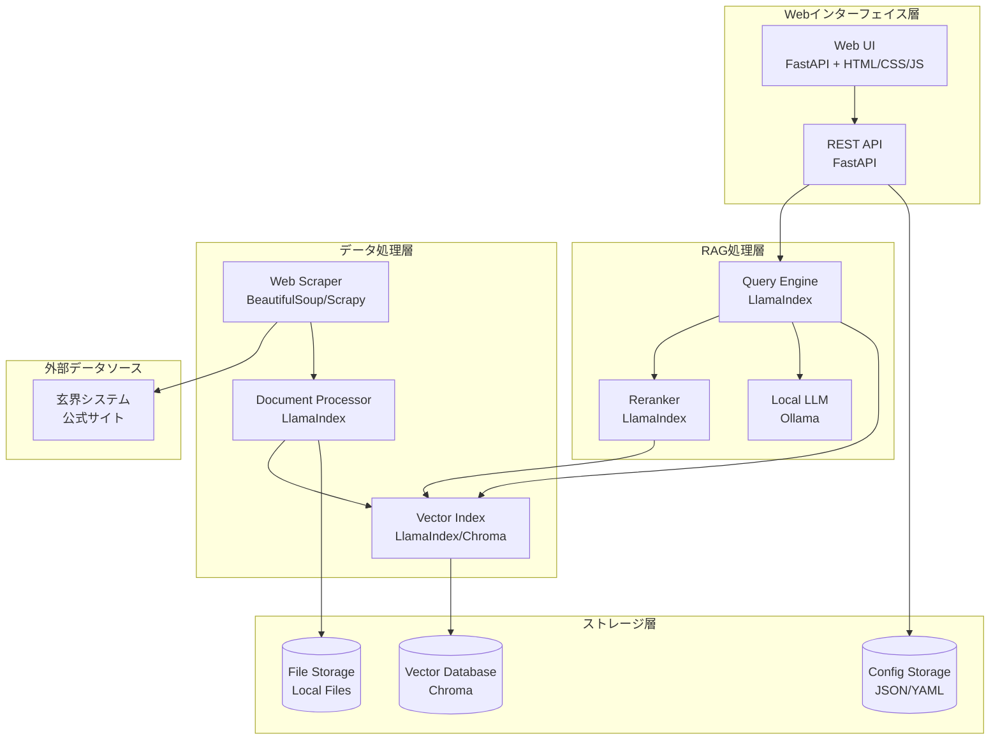

# 設計文書

## 概要

九州大学情報基盤研究開発センターのスーパーコンピュータ玄界システム用RAGシステムは、LlamaIndexを中核とした質問応答システムです。オンプレミス環境で動作し、日本語文書の処理に最適化されています。システムは文書取得・処理、RAG推論エンジン、Webインターフェイス、システム管理の4つの主要コンポーネントで構成されます。

## アーキテクチャ

### システム全体構成



### 技術スタック

- **Webフレームワーク**: FastAPI (高性能、非同期処理、自動API文書生成)
- **RAGフレームワーク**: LlamaIndex (包括的なRAG機能、日本語対応)
- **ローカルLLM**: Ollama (オンプレミス実行、モデル管理)
- **ベクトルデータベース**: Chroma (軽量、組み込み可能)
- **Webスクレイピング**: BeautifulSoup + Requests (日本語サイト対応)
- **フロントエンド**: HTML/CSS/JavaScript (シンプル、レスポンシブ)

## コンポーネントと インターフェイス

### 1. 文書取得・処理コンポーネント

**WebScraper クラス**
```python
class WebScraper:
    def scrape_website(self, base_url: str) -> List[Document]
    def extract_content(self, html: str) -> str
    def handle_japanese_encoding(self, response: requests.Response) -> str
```

**DocumentProcessor クラス**
```python
class DocumentProcessor:
    def chunk_documents(self, documents: List[Document]) -> List[Document]
    def create_embeddings(self, chunks: List[Document]) -> List[Embedding]
    def update_index(self, new_documents: List[Document]) -> bool
```

### 2. RAG推論エンジンコンポーネント

**RAGEngine クラス**
```python
class RAGEngine:
    def __init__(self, llm_model: str, vector_store: VectorStore)
    def query(self, question: str, chat_history: List[Message]) -> RAGResponse
    def retrieve_documents(self, query: str) -> List[Document]
    def rerank_documents(self, query: str, documents: List[Document]) -> List[Document]
    def generate_response(self, query: str, context: List[Document]) -> str
```

**LLMManager クラス**
```python
class LLMManager:
    def switch_model(self, model_name: str) -> bool
    def get_available_models(self) -> List[str]
    def optimize_for_model(self, model_name: str) -> Dict[str, Any]
```

### 3. Webインターフェイスコンポーネント

**FastAPI アプリケーション**
```python
@app.post("/api/query")
async def query_endpoint(request: QueryRequest) -> QueryResponse

@app.get("/api/models")
async def get_models() -> List[str]

@app.post("/api/models/{model_name}/switch")
async def switch_model(model_name: str) -> StatusResponse

@app.delete("/api/chat/history")
async def clear_chat_history(session_id: str) -> StatusResponse
```

**ChatManager クラス**
```python
class ChatManager:
    def save_message(self, session_id: str, message: Message) -> bool
    def get_chat_history(self, session_id: str, limit: int = 10) -> List[Message]
    def clear_history(self, session_id: str) -> bool
    def manage_history_size(self, session_id: str, max_size: int) -> bool
```

### 4. システム管理コンポーネント

**ConfigManager クラス**
```python
class ConfigManager:
    def load_config(self) -> Dict[str, Any]
    def save_config(self, config: Dict[str, Any]) -> bool
    def get_llm_config(self, model_name: str) -> Dict[str, Any]
    def update_llm_config(self, model_name: str, config: Dict[str, Any]) -> bool
```

**SystemMonitor クラス**
```python
class SystemMonitor:
    def check_memory_usage(self) -> float
    def check_disk_usage(self) -> float
    def log_system_status(self) -> bool
    def cleanup_old_data(self, retention_days: int) -> bool
```

## データモデル

### 文書データモデル

```python
@dataclass
class Document:
    id: str
    title: str
    content: str
    url: str
    section: str
    timestamp: datetime
    metadata: Dict[str, Any]

@dataclass
class DocumentChunk:
    id: str
    document_id: str
    content: str
    chunk_index: int
    embedding: Optional[List[float]]
```

### 会話データモデル

```python
@dataclass
class Message:
    id: str
    session_id: str
    role: str  # "user" or "assistant"
    content: str
    timestamp: datetime
    sources: List[str]

@dataclass
class ChatSession:
    session_id: str
    created_at: datetime
    last_activity: datetime
    message_count: int
```

### API データモデル

```python
@dataclass
class QueryRequest:
    question: str
    session_id: str
    model_name: Optional[str] = None

@dataclass
class QueryResponse:
    answer: str
    sources: List[DocumentSource]
    processing_time: float
    model_used: str

@dataclass
class DocumentSource:
    title: str
    url: str
    section: str
    relevance_score: float
```

## 正確性プロパティ

*プロパティとは、システムのすべての有効な実行において真であるべき特性や動作のことです。プロパティは、人間が読める仕様と機械で検証可能な正確性保証の橋渡しとなります。*

### プロパティ 1: Webスクレイピング機能
*任意の*有効なURLに対して、Webスクレイピングを実行した時、システムは文書コンテンツを正常に抽出し、適切な文字エンコーディング（UTF-8）で処理する
**検証: 要件 1.1**

### プロパティ 2: 文書チャンク分割
*任意の*文書に対して、チャンク分割を実行した時、システムは設定されたチャンクサイズ以下の断片に分割し、すべての元コンテンツが保持される
**検証: 要件 1.2**

### プロパティ 3: インデックス更新の一貫性
*任意の*文書更新に対して、インデックス更新を実行した時、システムは更新された文書が検索結果に反映され、古いバージョンは除外される
**検証: 要件 1.3**

### プロパティ 4: エラー処理の継続性
*任意の*文書処理エラーが発生した時、システムはエラーログを記録し、他の文書の処理を継続する
**検証: 要件 1.4**

### プロパティ 5: LLMモデル切り替え
*任意の*利用可能なLLMモデルに対して、モデル切り替えを実行した時、システムは新しいモデルを正常に読み込み、以降の質問で新しいモデルを使用する
**検証: 要件 2.3**

### プロパティ 6: 文書検索機能
*任意の*質問に対して、文書検索を実行した時、システムは関連する文書セクションを返し、各セクションには関連性スコアが付与される
**検証: 要件 2.4**

### プロパティ 7: 出典情報の包含
*任意の*質問に対して、回答を生成した時、システムは回答に使用された文書の出典URL、セクション名、関連性スコアを含める
**検証: 要件 2.6**

### プロパティ 8: Rerankingによる順序付け
*任意の*検索結果に対して、rerankingを実行した時、システムは文書を関連性スコアの降順で並び替える
**検証: 要件 2.7**

### プロパティ 9: 処理中表示
*任意の*質問送信に対して、システムは処理開始時に処理中インジケーターを表示し、回答完了時に非表示にする
**検証: 要件 3.2**

### プロパティ 10: 回答表示フォーマット
*任意の*生成された回答に対して、システムは回答テキストと出典情報を明確に区別して表示する
**検証: 要件 3.3**

### プロパティ 11: 会話履歴の保持
*任意の*セッション内で連続する質問に対して、システムは前の質問と回答を履歴として保持し、コンテキストに含める
**検証: 要件 3.4**

### プロパティ 12: セッション単位の履歴管理
*任意の*セッションに対して、システムは履歴をセッションIDで管理し、異なるセッション間で履歴が混在しない
**検証: 要件 3.5**

### プロパティ 13: 古い履歴の管理
*任意の*設定された履歴サイズ制限に対して、システムは制限を超えた古い履歴を削除し、最新の履歴のみを保持する
**検証: 要件 3.6**

### プロパティ 14: 履歴クリア機能
*任意の*セッションに対して、履歴クリアを実行した時、システムはそのセッションの全履歴を削除し、新しい会話として開始する
**検証: 要件 3.7**

### プロパティ 15: インデックス更新機能
*任意の*インデックス更新要求に対して、システムは新しい文書をインデックスに追加し、更新完了を通知する
**検証: 要件 4.2**

### プロパティ 16: システムログ記録
*任意の*システム操作に対して、システムは操作内容、実行時刻、結果をログファイルに記録する
**検証: 要件 4.3**

### プロパティ 17: リソース監視
*任意の*システム状態確認要求に対して、システムは現在のメモリ使用量とディスク使用量を正確に報告する
**検証: 要件 4.4**

### プロパティ 18: 応答時間の測定
*任意の*質問に対して、システムは処理開始から回答生成完了までの時間を測定し、記録する
**検証: 要件 6.1**

### プロパティ 19: 同時アクセス処理
*任意の*複数の同時質問に対して、システムは各質問を独立して処理し、相互に干渉しない
**検証: 要件 6.2**

### プロパティ 20: 更新中の継続動作
*任意の*インデックス更新中の質問に対して、システムは既存のインデックスを使用して回答を生成し、更新処理と並行して動作する
**検証: 要件 6.4**

### プロパティ 21: ホットスワップ機能
*任意の*LLMモデル切り替えに対して、システムは再起動なしに新しいモデルに切り替え、進行中の処理を中断しない
**検証: 要件 7.1**

### プロパティ 22: モデル最適化設定
*任意の*LLMモデルに対して、システムはモデル固有の最適化設定（温度、最大トークン数等）を適用する
**検証: 要件 7.3**

### プロパティ 23: 設定変更履歴
*任意の*設定変更に対して、システムは変更前の値、変更後の値、変更時刻を履歴として記録する
**検証: 要件 7.4**

### プロパティ 24: コンテキスト管理
*任意の*連続する質問に対して、システムは前の質問と回答をコンテキストとして含め、文脈を考慮した回答を生成する
**検証: 要件 8.1**

### プロパティ 25: 履歴選択機能
*任意の*長い会話履歴に対して、システムは現在の質問に最も関連性の高い履歴のみを選択してコンテキストに含める
**検証: 要件 8.2**

### プロパティ 26: セッション終了処理
*任意の*セッション終了に対して、システムは設定に基づいて履歴を保存または削除し、適切にリソースを解放する
**検証: 要件 8.3**

### プロパティ 27: 履歴保存期間管理
*任意の*設定された保存期間に対して、システムは期間を超えた履歴を自動的に削除し、プライバシーを保護する
**検証: 要件 8.4**

### プロパティ 28: 履歴サイズ制限
*任意の*設定されたサイズ制限に対して、システムは制限を超える履歴の追加を防ぎ、システム負荷を管理する
**検証: 要件 8.5**

## エラーハンドリング

### エラー分類と対応

**1. 文書取得エラー**
- ネットワーク接続エラー: リトライ機構（指数バックオフ）
- 文字エンコーディングエラー: 自動エンコーディング検出とフォールバック
- HTMLパースエラー: 部分的な内容抽出と警告ログ

**2. LLMモデルエラー**
- モデル読み込みエラー: フォールバックモデルへの自動切り替え
- 生成タイムアウト: 部分回答の返却と再試行オプション
- メモリ不足エラー: モデルサイズの自動調整

**3. データベースエラー**
- インデックス破損: 自動再構築機能
- ディスク容量不足: 古いデータの自動削除
- 同時アクセス競合: ロック機構とキューイング

**4. API エラー**
- 不正なリクエスト: 詳細なエラーメッセージとHTTPステータスコード
- レート制限: 適切な429レスポンスと再試行ヘッダー
- 内部サーバーエラー: ログ記録と汎用エラーメッセージ

### エラー回復戦略

```python
class ErrorRecoveryManager:
    def handle_scraping_error(self, error: Exception, url: str) -> Optional[Document]
    def handle_llm_error(self, error: Exception, query: str) -> str
    def handle_database_error(self, error: Exception, operation: str) -> bool
    def log_error(self, error: Exception, context: Dict[str, Any]) -> None
```

## テスト戦略

### 二重テストアプローチ

**ユニットテスト**: 特定の例、エッジケース、エラー条件を検証
- 各コンポーネントの個別機能テスト
- モックを使用した外部依存関係の分離
- エラーハンドリングの動作確認

**プロパティベーステスト**: すべての入力にわたる普遍的プロパティを検証
- 最小100回の反復実行
- ランダム入力生成による包括的カバレッジ
- 各プロパティは設計文書のプロパティを参照

### テスト設定

**プロパティベーステストライブラリ**: Hypothesis (Python)
- 各テストは最小100回の反復実行
- テストタグ形式: **Feature: genkai-rag-system, Property {number}: {property_text}**
- 各正確性プロパティは単一のプロパティベーステストで実装

### テストカバレッジ

**機能テスト**:
- 文書スクレイピングと処理
- RAG推論エンジン
- Webインターフェイス
- システム管理機能

**統合テスト**:
- エンドツーエンドの質問応答フロー
- 複数コンポーネント間の連携
- 外部サービス（Ollama）との統合

**パフォーマンステスト**:
- 応答時間測定
- 同時アクセス負荷テスト
- メモリ使用量監視

<function_calls>
<invoke name="prework">
<parameter name="featureName">genkai-rag-system