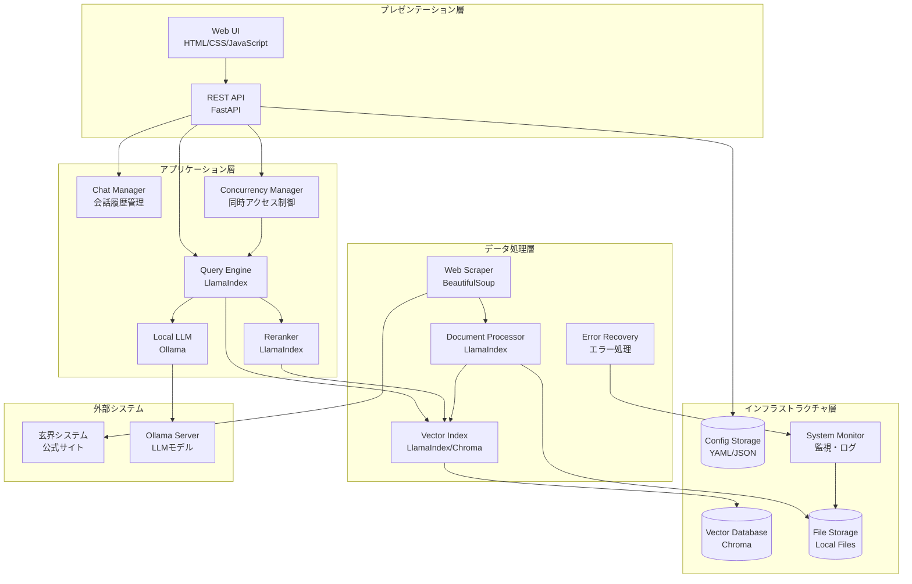
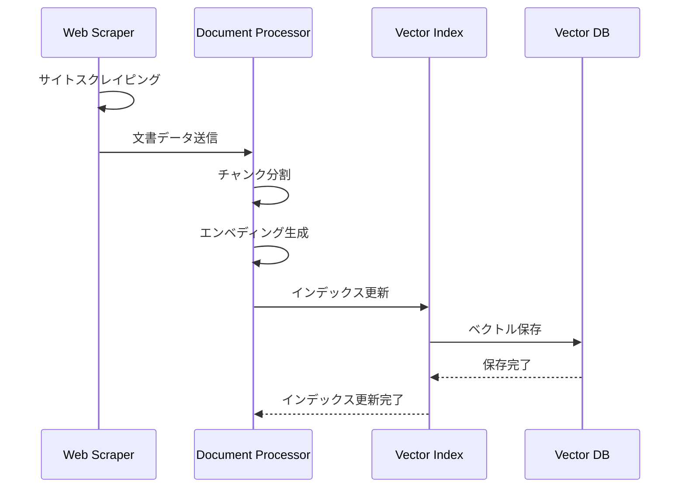
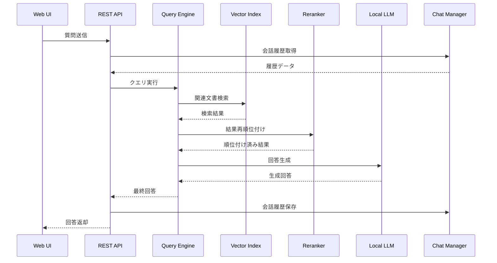

# 玄界RAGシステム アーキテクチャドキュメント

## 概要

玄界RAGシステムは、九州大学情報基盤研究開発センターのスーパーコンピュータ玄界システム用に設計されたRAG（Retrieval-Augmented Generation）質問応答システムです。本システムは、LlamaIndexを中核とした現代的なRAGアーキテクチャを採用し、オンプレミス環境での完全な運用を可能にします。

## システムアーキテクチャ

### 全体構成図



## アーキテクチャ層の詳細

### 1. プレゼンテーション層

#### Web UI
- **技術**: HTML5, CSS3, JavaScript (ES6+)
- **特徴**: レスポンシブデザイン、日本語対応、アクセシビリティ準拠
- **機能**: 
  - 質問入力フォーム
  - 回答表示（マークダウン対応）
  - 会話履歴表示
  - システム状態表示

#### REST API
- **技術**: FastAPI, Pydantic
- **特徴**: 自動API文書生成、型安全性、非同期処理
- **エンドポイント**:
  - `/api/query` - 質問応答
  - `/api/models` - モデル管理
  - `/api/chat` - 会話履歴
  - `/api/system` - システム管理

### 2. アプリケーション層

#### Query Engine (LlamaIndex)
- **役割**: RAG推論の中核エンジン
- **機能**:
  - 質問の意図理解
  - 関連文書の検索
  - コンテキスト構築
  - 回答生成の統合

#### Reranker
- **役割**: 検索結果の再順位付け
- **アルゴリズム**: セマンティック類似度ベース
- **効果**: 検索精度の向上、関連性の高い文書の優先

#### Local LLM (Ollama)
- **対応モデル**: 
  - `llama3.2:3b` - 高性能汎用モデル
  - `gemma2:2b` - バランス型モデル
  - `llama3.2:1b` - 軽量高速モデル
- **特徴**: オンプレミス実行、日本語対応、ホットスワップ対応

#### Chat Manager
- **機能**:
  - セッション管理
  - 会話履歴の保存・取得
  - コンテキスト管理
  - 履歴サイズ制限

#### Concurrency Manager
- **機能**:
  - 同時リクエスト制御
  - レート制限
  - キューイング
  - コネクションプール管理

### 3. データ処理層

#### Web Scraper
- **技術**: BeautifulSoup4, Requests
- **対象**: https://www.cc.kyushu-u.ac.jp/scp/
- **機能**:
  - 日本語エンコーディング自動検出
  - robots.txt準拠
  - レート制限
  - エラー処理・リトライ

#### Document Processor
- **技術**: LlamaIndex
- **機能**:
  - 文書チャンク分割
  - エンベディング生成
  - インデックス構築・更新
  - メタデータ管理

#### Vector Index
- **技術**: LlamaIndex + Chroma
- **特徴**:
  - 高速ベクトル検索
  - 永続化対応
  - バッチ処理最適化
  - インクリメンタル更新

### 4. インフラストラクチャ層

#### Vector Database (Chroma)
- **特徴**: 軽量、組み込み可能、永続化対応
- **設定**: 
  - コレクション名: `genkai_documents`
  - 永続化ディレクトリ: `./data/chroma_db`
  - バッチサイズ: 100-1000

#### File Storage
- **構造**:
  ```
  data/
  ├── chroma_db/          # ベクトルデータベース
  ├── chat_history/       # 会話履歴
  ├── index/              # インデックスファイル
  └── documents/          # 文書キャッシュ
  ```

#### Configuration Storage
- **形式**: YAML (設定), JSON (履歴・メタデータ)
- **階層**: default.yaml → production.yaml → 環境変数

#### System Monitor
- **監視項目**:
  - システムリソース（CPU、メモリ、ディスク）
  - 応答時間
  - エラー率
  - 同時接続数

## データフロー

### 1. 文書処理フロー



### 2. 質問応答フロー



## セキュリティアーキテクチャ

### 1. 認証・認可
- **現在**: 基本認証なし（内部システム想定）
- **拡張可能**: JWT、OAuth2.0対応

### 2. データ保護
- **暗号化**: 設定ファイル内の機密情報
- **アクセス制御**: ファイルシステムレベル
- **ログ保護**: 個人情報のマスキング

### 3. ネットワークセキュリティ
- **CORS設定**: 適切なオリジン制限
- **レート制限**: DDoS攻撃対策
- **入力検証**: SQLインジェクション等の対策

## パフォーマンス設計

### 1. スケーラビリティ
- **水平スケーリング**: 複数インスタンス対応
- **垂直スケーリング**: リソース使用量最適化
- **キャッシュ戦略**: 多層キャッシュ

### 2. 最適化手法
- **非同期処理**: FastAPIの非同期機能活用
- **バッチ処理**: 文書処理の効率化
- **コネクションプール**: データベース接続最適化
- **メモリ管理**: ガベージコレクション最適化

### 3. 監視・メトリクス
- **応答時間**: P50, P95, P99パーセンタイル
- **スループット**: RPS（Requests Per Second）
- **エラー率**: 4xx, 5xxエラーの監視
- **リソース使用率**: CPU、メモリ、ディスク

## 可用性・信頼性

### 1. エラーハンドリング
- **階層化エラー処理**: 各層での適切なエラー処理
- **フォールバック機能**: LLMモデル切り替え
- **リトライ機構**: 指数バックオフ

### 2. データ整合性
- **トランザクション**: 重要な操作の原子性保証
- **バックアップ**: 定期的なデータバックアップ
- **復旧機能**: 障害時の自動復旧

### 3. 監視・アラート
- **ヘルスチェック**: `/api/health`エンドポイント
- **ログ監視**: 構造化ログによる監視
- **メトリクス収集**: Prometheus互換メトリクス

## 拡張性

### 1. モジュラー設計
- **プラグイン機構**: 新しいLLMモデルの追加
- **インターフェイス分離**: 各コンポーネントの独立性
- **設定駆動**: コード変更なしの機能拡張

### 2. 統合可能性
- **API First**: RESTful API設計
- **標準プロトコル**: HTTP/HTTPS、JSON
- **ドキュメント**: OpenAPI仕様書自動生成

### 3. 将来の拡張計画
- **マルチテナント**: 複数組織対応
- **多言語対応**: 英語等の他言語サポート
- **GPU加速**: CUDA対応による高速化
- **分散処理**: Kubernetes対応

## 技術的制約・前提

### 1. ハードウェア要件
- **最小構成**: 4CPU、8GB RAM、20GB SSD
- **推奨構成**: 8CPU、16GB RAM、100GB SSD
- **GPU**: オプション（推論高速化）

### 2. ソフトウェア要件
- **OS**: Ubuntu 20.04+, CentOS 8+
- **Python**: 3.11+
- **Docker**: 20.10+（オプション）

### 3. ネットワーク要件
- **帯域幅**: 最小10Mbps
- **レイテンシ**: 玄界システムサイトへの低レイテンシ
- **ファイアウォール**: 8000番ポート開放

## 運用考慮事項

### 1. デプロイメント
- **Blue-Green Deployment**: ゼロダウンタイム更新
- **カナリアリリース**: 段階的な機能展開
- **ロールバック**: 迅速な障害復旧

### 2. 監視・保守
- **ログローテーション**: ディスク容量管理
- **定期メンテナンス**: インデックス最適化
- **セキュリティ更新**: 依存関係の定期更新

### 3. バックアップ・復旧
- **データバックアップ**: 日次自動バックアップ
- **設定バックアップ**: 変更履歴管理
- **災害復旧**: RTO/RPO目標設定

この包括的なアーキテクチャドキュメントは、システムの設計思想から運用まで、技術的な詳細を網羅しています。開発者、運用者、意思決定者それぞれの視点で活用できる内容となっています。